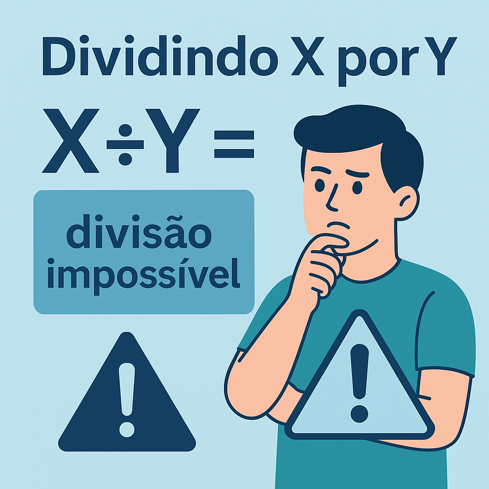

# Dividindo X por Y

Este projeto é uma aplicação de console simples em C# criada para ler pares de números e calcular a divisão entre eles. Ele também trata o caso em que o divisor é zero, informando que a divisão é impossível.

## 💡 Descrição

O programa:

- Lê a quantidade de divisões a serem realizadas.
- Para cada par de valores `X` e `Y`:
  - Calcula `X / Y` se `Y != 0`
  - Exibe `"divisao impossivel"` se `Y == 0`

## 🧪 Exemplo de entrada

```
3
3 2
4 0
10 5
```

## 📤 Exemplo de saída

```
1,5
divisao impossivel
2,0
```

## 🛠️ Tecnologias

- .NET Core 3.1
- C#

## 🚀 Como executar

1. Clone o repositório
2. Abra no Visual Studio ou rode pelo terminal com:

```bash
dotnet run --project ConsoleApp1
```

## 📁 Estrutura do Projeto

```
Dividindo X por Y/
├── ConsoleApp1/
│   ├── Program.cs
│   └── ConsoleApp1.csproj
├── Dividindo X por Y.sln
└── README.md
```

---

Desenvolvido com 💻 por [Danilo Costa](https://github.com/daniloercosta)
